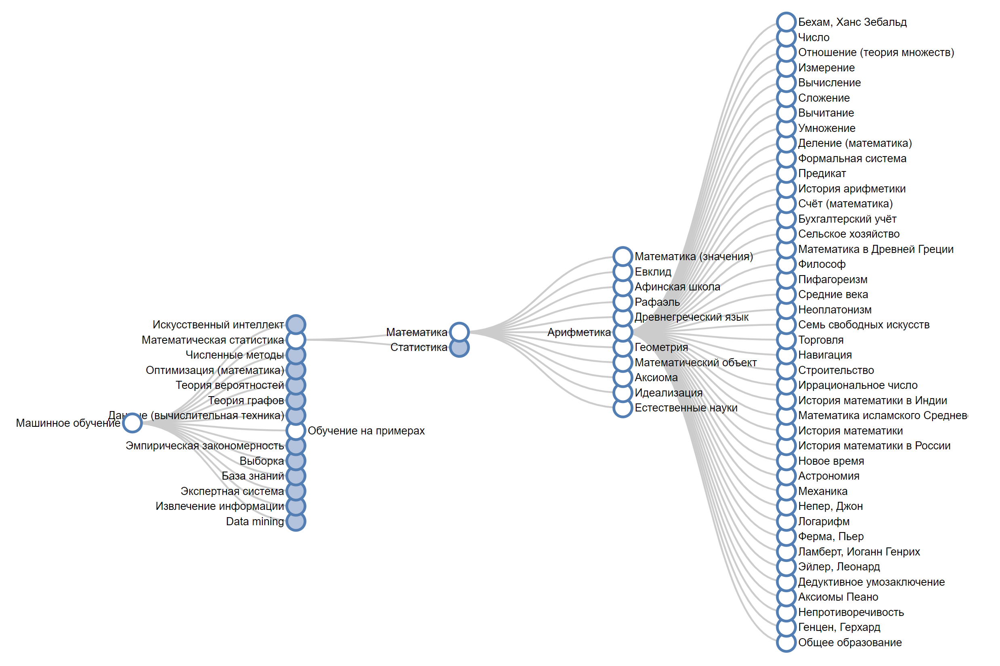

# Создание набора данных для построения индивидуальной траектории обучения. 
Команда #17: Next Dimension онлайн-дататона магистратуры "Наука о данных" МИСИС, 19-24 октября 2020 г.

## Авторы
Дмитрий Малышев - Product Owner, Марина Беляева - Project Manager, Евгений Влащенков - Data Researcher+Visualization, Николай Фардзинов - бизнес-аналитик, Игорь Скороходов - разработчик, Павел Озернов - технический писатель

## Описание
Датасет содержит ссылки на статьи в интернет-энциклопедии Wikipedia на русском языке, отобранные по принципу вложенности и релевантности в соотвествии с предметной областью "[Машинное обучение](https://ru.wikipedia.org/wiki/%D0%9C%D0%B0%D1%88%D0%B8%D0%BD%D0%BD%D0%BE%D0%B5_%D0%BE%D0%B1%D1%83%D1%87%D0%B5%D0%BD%D0%B8%D0%B5)". Каждый уровень вложенности включает все ссылки статьи кроме ссылок (????). Глубина вложенности - 10 уровней. Дублирующие и нерелевантные ссылки были удалены. Структура датасета - дерево. Общее число статей-ссылок в датасете - ??. В набор датасета включена визуализация в формате .png. Пример визуализации (неполная):

## Источники
В качестве источников изображений использовалась "[интернет-энциклопедия Wikipedia](https://ru.wikipedia.org)" на русском языке.

## Методы сбора и обработки
Сбор датасета проводился методом парсинга ссылок в теле Content текущей статьи на другие релевантные для рассматриваемой теме статьи. Парсинг осуществлялся с использованием библиотеки Beautiful Soup Python. Файл исходного кода приложен в датасет. Для визуализации использовалась "[Javascript-библиотека D3](https://d3js.org/)", в частности примеры из статьи "[Tree diagrams in d3.js](http://www.d3noob.org/2014/01/tree-diagrams-in-d3js_11.html)".

## Структура репозитория
Каталог содержит папку data с образцами датасета в формате ???, файлы исходного кода Python, файлы визуализации в формате .png.

Репозиторий содержит 48 каталогов для каждой буквы. Всего в датасете содержатся 467 изображений. 
Все изображения представлены в формате .jpg. 
Формат названия файлов: например, “a2.jpg”, где a - буква азбуки, а число 1 - порядковый номер образца.
